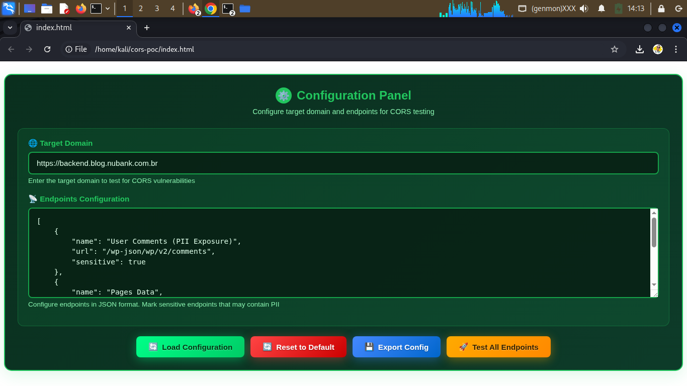

```markdown
# 🔓 CORS Vulnerability POC

Professional CORS testing tool for security researchers and bug bounty hunters.
```



## 🚀 Quick Start

```bash
# Clone repository
git clone https://github.com/ragaboolla/cors-poc.git
cd cors-poc

# Open in browser
open index.html
```

Or visit: [https://ragaboolla.github.io/cors-poc/](https://ragaboolla.github.io/cors-poc/)

## ⚡ Features

- 🔍 **Real-time CORS exploitation testing**
- ⚙️ **Configurable target endpoints**
- 🎯 **PII detection and highlighting**
- 📊 **Professional security reporting**
- 🎨 **Beautiful hacker-style interface**
- 💾 **Export/Import configurations**

## 🛠️ Usage

1. **Configure Target Domain**: Set the target domain you want to test
2. **Configure Endpoints**: Add endpoints in JSON format
3. **Load Configuration**: Apply your settings
4. **Test Endpoints**: Run individual or batch tests
5. **Analyze Results**: Review CORS vulnerability findings

## ⚠️ Disclaimer

This tool is for **educational purposes and authorized testing only**. Only use on systems you own or have explicit permission to test.

## 🔧 Configuration

The tool supports custom configurations:

- **Target Domain**: The domain to test for CORS vulnerabilities
- **Endpoints**: JSON array of endpoints with names, URLs, and sensitivity flags
- **PII Detection**: Mark endpoints that may contain Personally Identifiable Information

## 📝 License

This project is for educational purposes. Use responsibly and ethically.

## 🐛 Bug Reports

Found an issue? Please open an issue on GitHub.

## 🤝 Contributing

Contributions are welcome! Feel free to submit pull requests.
```

الموقع هيشتغل بشكل كامل مع كل المميزات! 🚀
